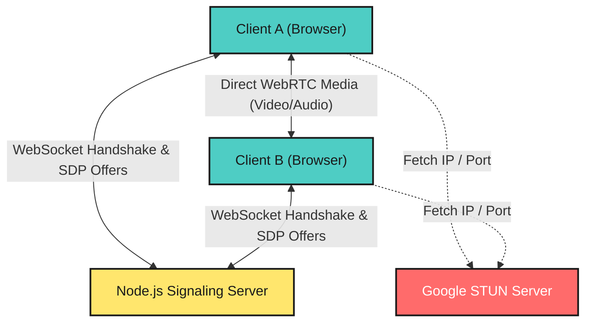

# Let'sMeet Architecture & System Design

Let'sMeet is a highly optimized, open-source peer-to-peer communication platform. It facilitates anonymous, low-latency video and text interactions globally. The application leverages a modern technology stack to achieve real-time synchronization, utilizing a hybrid architecture of centralized signaling and decentralized media routing.

## Technology Stack

*   **Frontend:** React 18, Vite, TailwindCSS (Custom Design System)
*   **Backend:** Node.js, Express.js
*   **Real-time Protocol:** Socket.io (WebSocket with HTTP long-polling fallback)
*   **Media Transport:** WebRTC (RTCPeerConnection, STUN/TURN protocols)

---

## Current System Architecture

The current implementation is designed as a monolithic signaling service optimized for medium-scale concurrency. It operates on a two-tier architectural model:



### 1. Signaling & State Management Layer (Node.js)
The backend acts strictly as a state manager and signaling relay. It does not process or route media payloads.
*   **Matchmaking Engine:** Utilizes an in-memory Queue structure partitioned by connection preferences (Video/Text, Interests, Geolocation).
*   **Session Management:** Implements tab-specific Session ID tracking via `sessionStorage` and query parameters. This prevents connection inflation and handles TCP drops/reconnects deterministically without ghost-socket duplication.
*   **Signaling Relay:** Implements a buffered message queue. Due to the asynchronous nature of WebRTC negotiation, the server buffers SDP (Session Description Protocol) offers and ICE candidates until the recipient acknowledges WebRTC listener readiness, preventing race conditions.

### 2. Media Transport Layer (WebRTC)
All heavy data transfer (Video/Audio streams) bypasses the backend entirely to ensure zero bandwidth cost and minimal latency.
*   **Peer Discovery:** The client queries public STUN servers (`stun.l.google.com`) to resolve their public-facing IP address and NAT (Network Address Translation) port mapping.
*   **Peer-to-Peer Routing:** Once negotiated, a direct UDP connection is established between the two clients. 
*   **Stream Handling:** The application leverages immutable `MediaStream` processing to force React DOM reconciliations upon dynamic track additions (`ontrack` events).

---

## High Availability & Scalability Blueprint

To scale Let'sMeet to handle millions of concurrent users (e.g., enterprise scale), the architecture must migrate from a stateful monolith to a horizontally distributed, stateless microservices architecture. Below is the blueprint for that migration.

```mermaid
graph TD
    classDef client fill:#4ecdc4,stroke:#1a1a1a,stroke-width:2px,color:#1a1a1a;
    classDef server fill:#ffe66d,stroke:#1a1a1a,stroke-width:2px,color:#1a1a1a;
    classDef stun fill:#ff6b6b,stroke:#1a1a1a,stroke-width:2px,color:#fff;
    classDef redis fill:#d32f2f,stroke:#1a1a1a,stroke-width:2px,color:#fff;
    classDef matcher fill:#1976d2,stroke:#1a1a1a,stroke-width:2px,color:#fff;

    subgraph Clients
        A["Client A"]:::client
        B["Client B"]:::client
    end

    subgraph Backend Cluster
        LB{"Layer 4 Load Balancer"}:::server
        Node1["Node.js Worker 1"]:::server
        Node2["Node.js Worker 2"]:::server
        Redis[("Redis (Queue & Pub/Sub)")]:::redis
        Matcher["Matcher Microservice"]:::matcher
    end

    subgraph Media Relay
        TURN["Coturn Cluster (TURN)"]:::stun
    end

    A <-->|WSS| LB
    B <-->|WSS| LB
    LB -->|Sticky| Node1
    LB -->|Sticky| Node2
    Node1 <-->|Push/Sub| Redis
    Node2 <-->|Push/Sub| Redis
    Redis <-->|Process Queue| Matcher
    A -.->|Fallback Relay| TURN
    B -.->|Fallback Relay| TURN
    A <-->|"Direct P2P (if STUN succeeds)"| B
```



### 1. Distributed Signaling with Redis
WebSocket connections are inherently stateful, meaning a user must remain connected to the same server node. If User A is on Node 1, and User B is on Node 2, they cannot match using in-memory arrays.
*   **Load Balancing:** Deploy a Layer 4 (TCP) Load Balancer (e.g., AWS Network Load Balancer or HAProxy) configured with Sticky Sessions to distribute WebSocket connections across a cluster of Node.js instances.
*   **Redis Pub/Sub:** All Node.js instances will connect to a central Redis cluster. When Node 1 attempts to match User A, it pushes the request to a Redis Queue.
*   **Independent Matcher Microservice:** A separate, highly concurrent service (written in Go or Rust) will consume the Redis Queue, compute optimal pairs using a scoring algorithm, and publish the result via Redis Pub/Sub back to the respective Node.js instances.

### 2. Media Relay Fallback (TURN Cluster)
STUN servers successfully traverse NATs for approximately 80% of users. For the remaining 20% located behind strict corporate firewalls or Symmetric NATs, direct P2P connections are physically impossible.
*   **Coturn Deployment:** Deploy a globally distributed cluster of TURN servers (using the open-source Coturn project).
*   **Bandwidth Cost:** Unlike STUN, TURN servers must manually relay the encrypted video packets between clients. This requires significant cloud bandwidth allocation and regional geographic routing to minimize latency.

### 3. Edge-Level Moderation
Manual moderation is impossible at scale. Platform safety must be automated prior to connection establishment.
*   **Client-Side Sampling:** The React application extracts a base64 frame from the local video feed at randomized intervals.
*   **AI Inference:** The frame is dispatched to a Machine Learning endpoint (e.g., AWS Rekognition) to scan for explicit content.
*   **Distributed Banning:** If flagged, the user's IP address is pushed to a global Redis blocklist. The Layer 4 Load Balancer intercepts the TCP handshake of blocked IPs, severing the connection before it utilizes Node.js compute resources.

---

## Local Development Initialization

**1. Clone and Install Dependencies**
```bash
git clone https://github.com/ishivamgaur/LetsMeet.git
cd LetsMeet

# Install Server Dependencies
cd server
npm install

# Install Client Dependencies
cd ../client
npm install
```

**2. Execute Development Servers**
You must run both the frontend and backend concurrently in separate terminal instances.

*Backend:*
```bash
cd server
npm run dev
```

*Frontend:*
```bash
cd client
npm run dev
```

Navigate to `http://localhost:5173`. Open multiple tabs to test the internal matchmaking queue and WebRTC stream negotiation.
